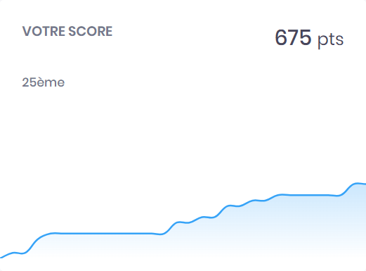

# DGhAck-2023-writeup

Voici les réflexions menées pour résoudre certains des challenges proposés lors du [DG'hAck 2023](https://www.dghack.fr/). 
Le CTF s'est déroulé du 16 au 30 novembre 2023 en ligne et a réuni 436 compétiteurs.

## Résultat obtenu

<table>
  <tbody>
    <tr>
      <td></td>
    </tr>
  </tbody>
</table>

## Challenges résolus

<table>
 <thead><tr><th>Catégorie</th><th>Challenge</th><th>Niveau</th><th>Points obtenus</th><th>Flags obtenus</th></tr></thead>
 <tbody>
  <tr><td rowspan=2>crypto</td>
        <td><a href="./crypto/CryptoNeat/CryptoNeat.md">CryptoNeat</a></td><td>Facile</td><td>50 / 50</td><td>1 / 1</td></tr>
    <tr><td><a href="./crypto/AEgisSecureForge/AEgisSecureForge.md">AEgisSecureForge</a></td><td>Difficile</td><td>200 / 200</td><td>3 / 3</td></tr>
  <tr><td rowspan=1>forensics</td>
        <td><a href="./forensics/A_Maritime_Journey/A_Maritime_Journey.md">A_Maritime_Journey</a></td><td>Moyen</td><td>125 / 150</td><td>5 / 6</td></tr>
  <tr><td rowspan=1>reverse</td>
        <td><a href="./reverse/Wrongsomewhere/Wrongsomewhere.md">Wrongsomewhere</a></td><td>Facile</td><td>50 / 50</td><td>1 / 1</td></tr>
  <tr><td rowspan=1>stegano</td>
        <td><a href="./stegano/A_Maze_In/A_Maze_In.md">A Maze In</a></td><td>Facile</td><td>50 / 50</td><td>1 / 1</td></tr>
  <tr><td rowspan=2>web</td>
        <td><a href="./web/Remove_Before_Flight/Remove_Before_Flight.md">Remove Before Flight</a></td><td>Moyen</td><td>100 / 100</td><td>1 / 1</td></tr>
    <tr><td><a href="./web/JarJarBank/JarJarBank.md">JarJarBank</a></td><td>Difficile</td><td>100 / 300</td><td>1 / 2</td></tr>
 </tbody>
</table>
