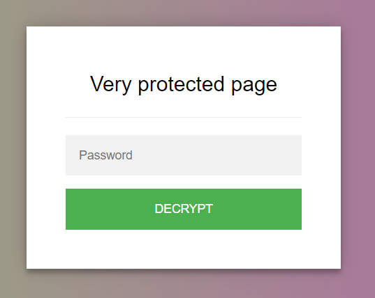
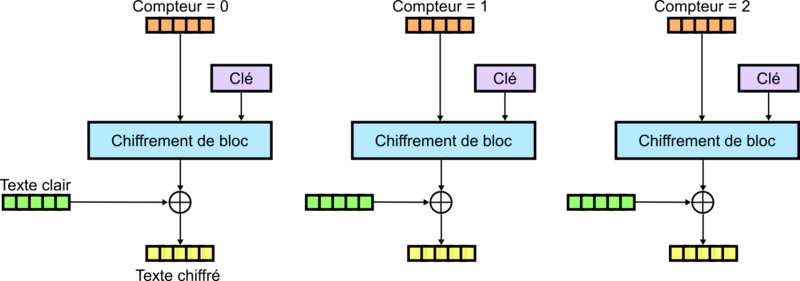
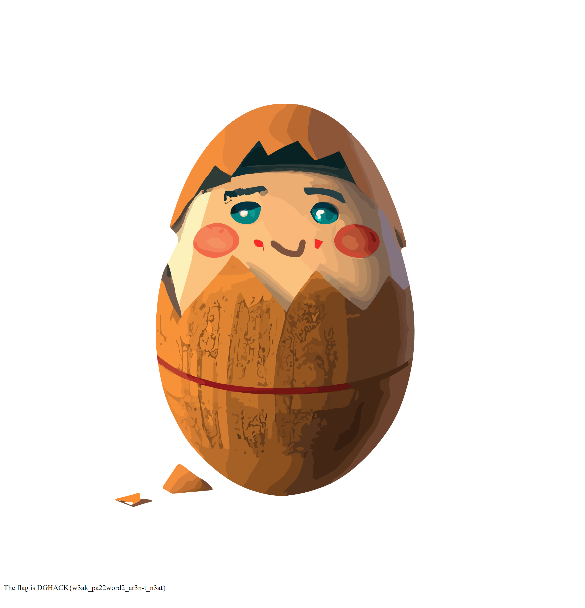

# CryptoNeat

### Description

Une information tres secrète est dissimulée dans cette page web.

Saurez-vous la trouver ?

### Accès à l'épreuve

http://cryptoneat2.chall.malicecyber.com/

----

### 1. Récupération du code HTML de la page

La page présente un formulaire invitant à la saisie d'un mot de passe :




Le code source de la page, montre des informations intéressantes.

La requête suivante permet d'en récupérer le code HTML :
```http
GET http://cryptoneat2.chall.malicecyber.com/ HTTP/1.1
```

Voici un extrait contenant les éléments dignent d'intérêt :
```html
<script>
    // CRYPT_VERSION: async

    const cryptEngine = ((function(){
  const exports = {};
  
var iv = CryptoJS.lib.WordArray.random(128 / 8);
exports.cryptoThanks = "Build with love, kitties and flowers";


// Derive password
function derivePassword(password) {
  var key = CryptoJS.PBKDF2(password, "", {
    keySize: 128 / 32,
    iterations: 1000
  });
  return key;
}
exports.derivePassword = derivePassword;


// Encrypt text with password
function encrypt(msg, password) {
  key = derivePassword(password);
  var encrypted = CryptoJS.AES.encrypt(msg, key, {
    iv: iv,
    padding: CryptoJS.pad.Pkcs7,
    mode: CryptoJS.mode.CTR,
  });
  return iv.toString() + encrypted.toString();
}
exports.encrypt = encrypt;

// Decrypt text with password
 function decrypt(encryptedMsg, password) {
  key = derivePassword(password);
  var iv = CryptoJS.enc.Hex.parse(encryptedMsg.substr(0, 32));
  var encrypted = encryptedMsg.substring(32);
  return CryptoJS.AES.decrypt(encrypted, key, {
    iv: iv,
    padding: CryptoJS.pad.Pkcs7,
    mode: CryptoJS.mode.CTR,
  }).toString(CryptoJS.enc.Utf8);
}
exports.decrypt = decrypt;


  return exports;
})())

    // variables to be filled when generating the file
    const encryptedMsg = '34aff6de8f8c01b25c56c52261e49cbddQsBGjy+uKhZ7z3+zPhswKWQHMYJpz7wffAe4Es/bwrJmMo99Kv7XJ8P63TbN/8X...'
        labelError = 'Sorry, bad password...';

    const encryptedMsg2 = '34aff6de8f8c01b25c56c52261e49cbdC19FW3jqqqxd6G/z0fcpnOSIBsUSvD+jZ7E9/VkscwDMrdk9i9efIvJw1Fj6Fs0R';

    // Decrypt encrypted page, replace the HTML
    async function decryptSetHtml(passphrase) {
        const result = await cryptEngine.decrypt(encryptedMsg, passphrase);
        const plainHTML = result;

        document.write(plainHTML);
        document.close();
        return true;
    }

    // Show the prompt
    window.onload = async function () {
        document.getElementById("crypt_loading").classList.add("hidden");
        document.getElementById("crypt_content").classList.remove("hidden");
        document.getElementById("crypt-password").focus();
    }

    // handle password submission
    document.getElementById('crypt-form').addEventListener('submit', async function (e) {
        e.preventDefault();

        const passphrase = document.getElementById('crypt-password').value;

        // decrypt and replace the page
        try {
            const isDecryptionSuccessful = await decryptSetHtml(passphrase);
        }
        catch(error) {
            alert(labelError);
        }
    });
</script>
```

NB : Un exemple de réponse complète est disponible [ici](Response-1700812597414.http)

----

### 2. Analyse du code source

Les 2 fonctions `encrypt` et `decrypt` montrent que :
- l'algorithme de chiffrement/déchiffrement utilisé est AES-128 en mode CTR, avec un [padding PKCS7](https://en.wikipedia.org/wiki/Padding_(cryptography)#PKCS#5_and_PKCS#7)
- que la clé secrète de chiffrement/déchiffrement est obtenue par dérivation d'un mot de passe `password`
- que cette fonction de dérivation `derivePassword` est [PBKDF2](https://fr.wikipedia.org/wiki/PBKDF2), utilisée sans "salt", avec 1.000 itérations, pour obtenir une clé de 128-bits (soit 16 octets)
- que le message chiffré est ensuite encodé en base64
- que le vecteur d'initialisation `iv` utilisé est positionné devant le message chiffré.


Voici un schéma, issu d'un article [Wikipedia](https://fr.wikipedia.org/wiki/Mode_d%27op%C3%A9ration_(cryptographie)#%C2%AB_CounTeR_%C2%BB_(CTR):_chiffrement_bas%C3%A9_sur_compteur), qui montre le principe du chiffrement AES en mode CTR :




Donc si $P$ est le message en clair, $C_{key}$ la clé chiffrée et $C$ le message chiffré, on a alors la correspondance suivante :

$$ C = C_{key} \oplus P $$

NB : $C_{key}$ est différent pour chaque bloc de 128 bits (i.e. 16 octets)

Dans le cas où la même clé et le même vecteur d'initialisation sont utilisés pour chiffrer 2 messages $P_1$ et $P_2$ on a les 2 relations suivantes :

$$ C_1 = C_{key} \oplus P_1 $$

$$ C_2 = C_{key} \oplus P_2 $$

Si on les combine, comme $C_{key} \oplus C_{key} = 0$ , on obtient :

$$ C_1 \oplus C_2 = P_1 \oplus P_2 $$

On voit qu'il est possible de retrouver $P_1$, si on dispose de $P_2$, $C_1$ et $C_2$ :

$$ P_1 = P_2 \oplus C_1 \oplus C_2 $$

Si on revient dans le code source, on trouve :
- 2 messages chiffrés `encryptedMsg` et `encryptedMsg2`
- d'après les fonctions `encrypt` et `decrypt`, le vecteur d'initialisation correspond aux 32 premiers caractères (i.e. 16 octects en hexa) de ces messages
- c'est le même vecteur d'initialisation qui a été utilisé pour le chiffrement des 2 messages : `34aff6de8f8c01b25c56c52261e49cbd`
- on suppose que le chiffrement des 2 messages a été réalisé avec la même clé.
- on suppose que `encryptedMsg2` est le résultat du chiffrement de `cryptoThanks`

A partir de ces hypothèses, on applique la formule précédente pour retrouver le début du message en clair (en l'occurrence les 3 premiers blocs) correspondant à `encryptedMsg` :
- sans oublier d'utiliser un padding PKCS7 sur `cryptoThanks`
- sans oublier d'appliquer au préalable un décodage base64 sur les messages chiffrés.

Le script [decode-cryptoneat.py](decode-cryptoneat.py) permet de retrouver le message :
```
<!-- temporary password : My2uperPassphras3 -->\n
```

En utilisant `My2uperPassphras3` comme mot de passe, un magnifique oeuf s'affiche avec en bas le flag :



Le flag est donc : `DGHACK{w3ak_pa22word2_ar3n-t_n3at}`
