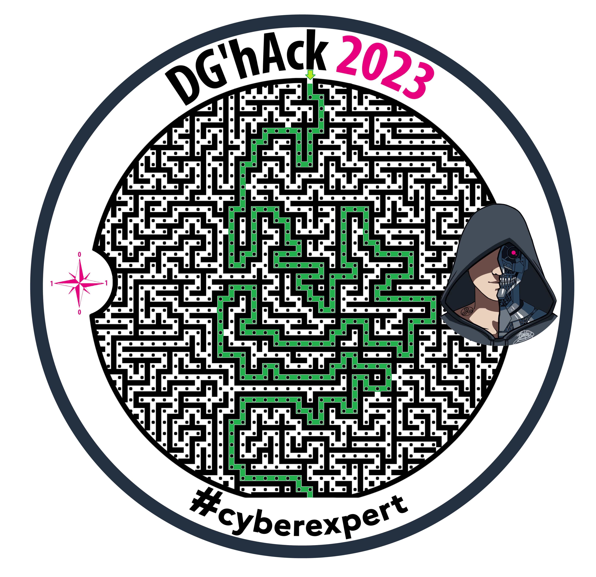

# A Maze In

### Description

Rendez-vous au stand DGA lors de l’European Cyber Week 2023 qui se tiendra à Rennes du 21 au 23 novembre 2023, un challenge se cache dans un des goodies qui vous seront offerts.

Saurez-vous le retrouver et le résoudre ?

### Fichiers joints

* [AMazeIn.png](AMazeIn.png)

----

La première étape consiste à trouver le chemin à travers le labyrinthe :



Puis en partant du haut, pour chaque point de ce chemin, on lui attribue la valeur (0 ou 1) en fonction de la direction à suivre pour l'atteindre, comme indiqué sur la rose des vents.

On obtient ainsi la séquence suivante, que l'on peut découper en bloc de 8 éléments afin d'obtenir un message (en utilisant l'encodage ASCII) :
```
01000100 => D
01000111 => G
01001000 => H
01000001 => A
01000011 => C
01001011 => K
01111011 => {
01010100 => T
01101000 => h
00110001 => 1
01110011 => s
01011111 => _
00110001 => 1
01110011 => s
01011111 => _
01110100 => t
01101000 => h
00110011 => 3
01011111 => _
01010111 => W
00110100 => 4
01011001 => Y
01011111 => _
00100001 => !
01111101 => }
```

On obtient ainsi le flag : `DGHACK{Th1s_1s_th3_W4Y_!}`
